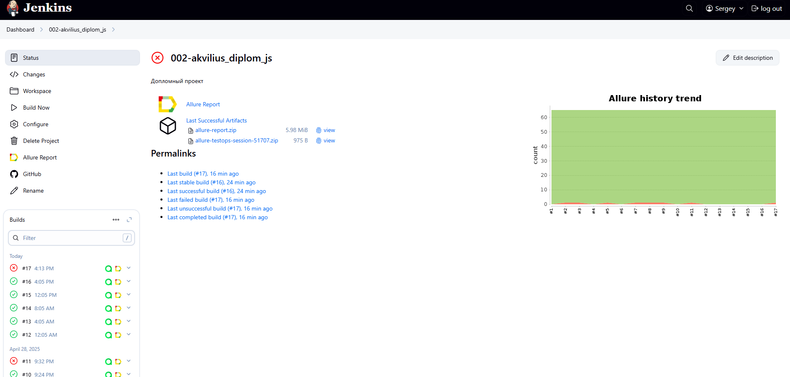
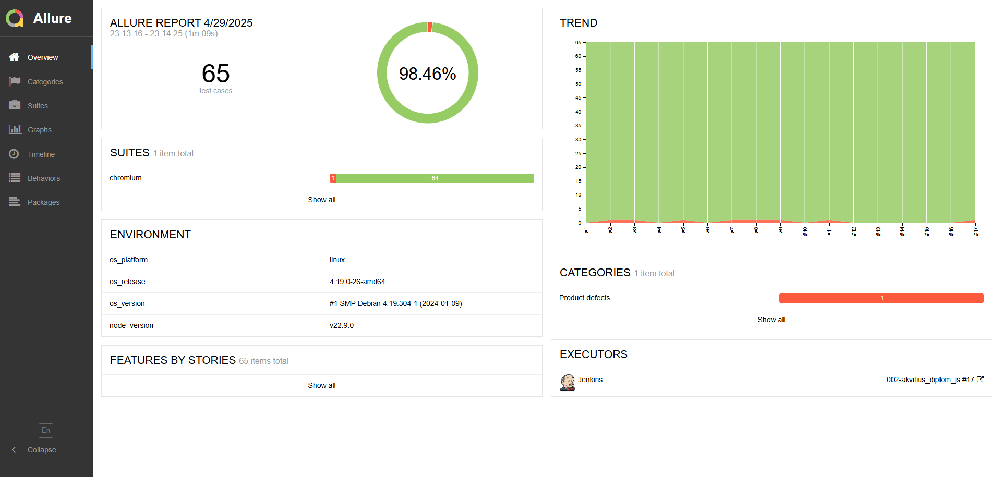
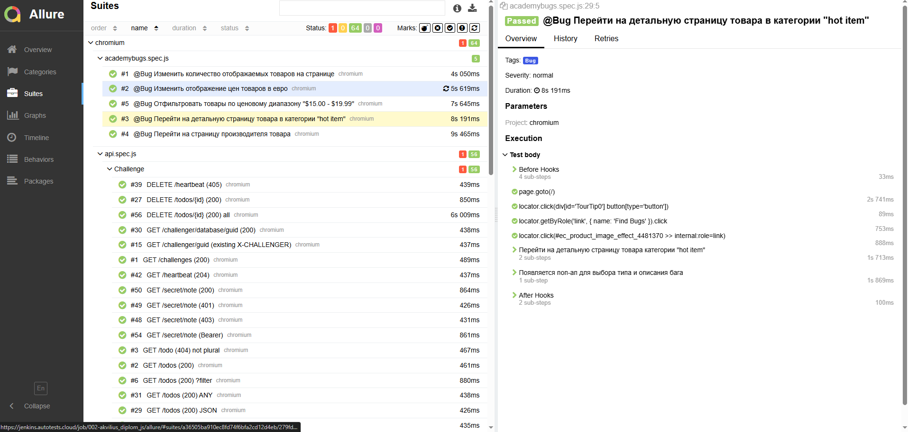
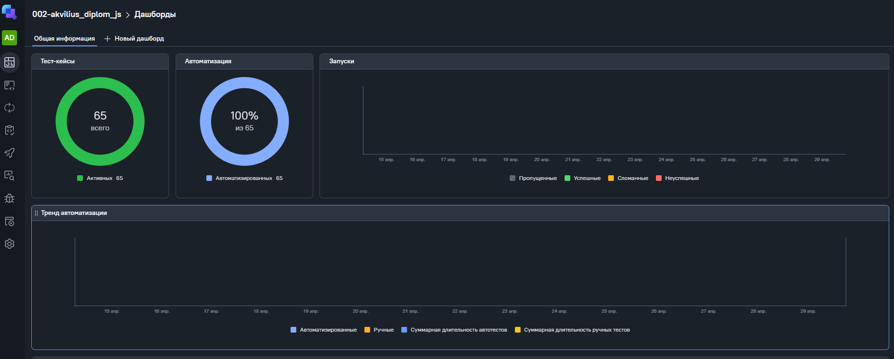
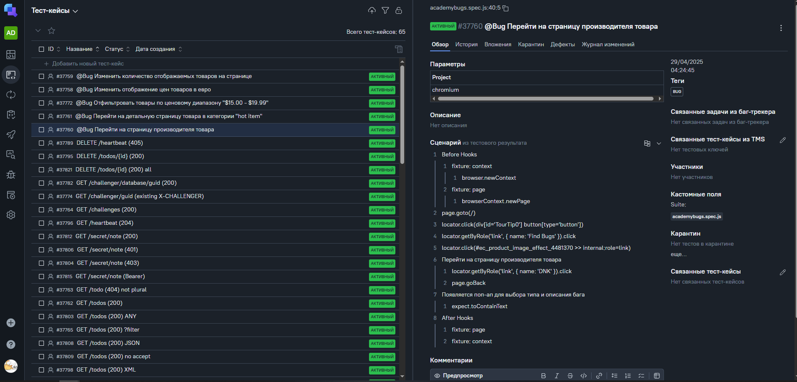
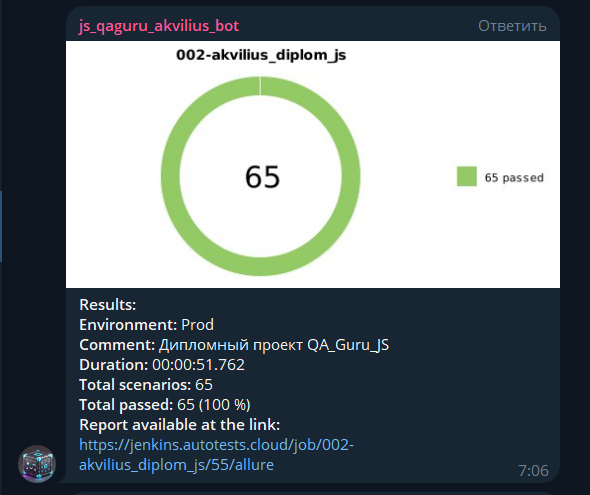

## Проект автоматизации тестирования собранный на основе [курса по автоматизации тестирования на JavaScript + Playwright](https://qa.guru/playwright_js)
---
## Содержание
- [Описание](#Описание)
- [Стек](#Стек)
- [Тест-кейсы](#Тест-кейсы)
- [Запуск тестов и генерация отчетов](#Запуск-тестов-и-генерация-отчетов)
- [Запуск пайплайна автотестов в Jenkins](#-Запуск-пайплайна-автотестов-в-Jenkins)
- [Пример Allure-отчета](#-Пример-Allure-отчета)
- [Пример интеграции с ТестОпс](#-Пример-интеграции-с-ТестОпс)
- [Уведомления в Telegram чат с ботом](#-уведомления-в-telegram-чат-с-ботом)

---
## Описание

Данный репозиторий представляет собой объединение всех учебных проектов в один. Он служит для демонстрации итогов обучения.

---
## Стек
<div align="center">
  
  
  
  
  
  
  
</div>

В этом репозитории собраны UI и API-тесты, написанные на JavaScript с использованием Playwright. Для CI/CD задействован Jenkins, который обеспечивает выполнение автотестов, генерацию Allure-отчетов, взаимодействие с TestOps и рассылку уведомлений в Telegram.

---
## Тест-кейсы
- UI
  - [RealWorld](https://realworld.qa.guru/)
    - Пользователь может опубликовать статью
    - Пользователь может оставить комментарий к статье
    - Пользователь может изменить пароль
  - [AcademyBugs](https://academybugs.com/find-bugs/)
    - Перейти на страницу производителя товара
    - Перейти на детальную страницу товара в категории "hot item"
    - Отфильтровать товары по ценовому диапазону "$15.00 - $19.99"
    - Изменить отображение цен товаров в евро
    - Изменить количество отображаемых товаров на странице
- API
    - 57 тестов из списка [API Challenges Progress](https://apichallenges.herokuapp.com/gui/challenges/)
---
## Запуск тестов и генерация отчетов

Команда для локального запуска всех тестов
```
npm run test
```
Команда для локального запуска UI тестов
```
npm run realWordsTest
npm run academyBugsTest
```
Команда для локального запуска API тестов
```
npm run apiTest
```
Команда для локального формирования отчета

```
npm run allure
```
---
## Запуск пайплайна автотестов в [Jenkins](https://jenkins.autotests.cloud/job/002-akvilius_diplom_js/)

Для запуска пайплайна необходимо авторизоваться на сайте [Jenkins](https://jenkins.autotests.cloud/), перейти в соответствующую [джобу](https://jenkins.autotests.cloud/job/002-akvilius_diplom_js/) и нажать <code>Build Now</code>. После завершения сборки будет сформирован <code>Allure-отчет</code>, результаты сборки будут отправлены в <code>ТестОпс</code>, а так же в <code>Telegram</code>. В разделе <code>Builds</code> напротив номера сборки появятся иконки Allure (cсылка на Allure-отчет так же есть на основной странице) и ТестОпс, перейдя по которым можно посмотреть результаты сборки.



---
##  Пример [Allure-отчета](https://jenkins.autotests.cloud/job/002-akvilius_diplom_js/allure/)



---
##   Пример интеграции с [ТестОпс](https://allure.autotests.cloud/project/4735/dashboards)



---


##  Уведомления в Telegram чат с ботом

После завершения сборки специальный бот, созданный в <code>Telegram</code>, автоматически обрабатывает и отправляет сообщение с отчетом о прогоне тестов. Доболнительно запускается задача по крону раз в 4 часа. Результаты бот присылает в группу [**Уведомления о тестах**](https://t.me/+KKSAFc_OhppiNjAy)

### Уведомление из переписки с чат ботом


<p align="center">

</p>


#### Содержание уведомления в Telegram

- :heavy_check_mark: Окружение
- :heavy_check_mark: Комментарий
- :heavy_check_mark: Длительность прохождения тестов
- :heavy_check_mark: Общее количество сценариев
- :heavy_check_mark: Процент прохождения тестов
- :heavy_check_mark: Ссылка на Allure отчет